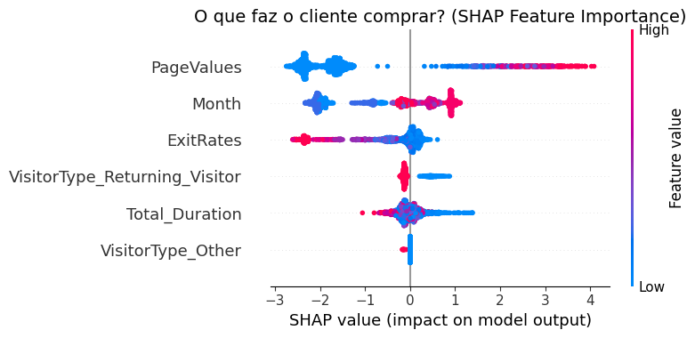

# 🛒 Previsão de Intenção de Compra no E-commerce com Machine Learning

## 🎯 Objetivo do Projeto e O Problema de Negócio

Imagine um e-commerce recebendo milhares de visitantes todos os dias. A grande maioria entra, olha as vitrines digitais, e vai embora sem comprar nada. E se pudéssemos **prever, em tempo real**, qual visitante está apenas "dando uma olhadinha" e qual está pronto para comprar? 

Este projeto resolve exatamente esse problema. Desenvolvi um modelo de **Machine Learning** capaz de prever se um usuário completará uma transação (Revenue) com base exclusiva no seu comportamento de navegação no site. 

O foco deste projeto foi aliar métricas técnicas de Inteligência Artificial aos **objetivos reais de negócio**, priorizando a identificação assertiva de potenciais compradores.

### 💡 A Estratégia Adotada:
1. **Análise Exploratória (EDA):** Identificar gatilhos que levam à conversão e comportamentos que indicam abandono de carrinho.
2. **Modelagem Preditiva:** Comparar algoritmos clássicos, ensembles avançados e Deep Learning para encontrar a melhor performance.
3. **Otimização de Hiperparâmetros (Optuna):** Ajuste fino com foco obsessivo na métrica de **Recall**, garantindo que não deixaremos compradores reais escaparem (minimizando Falsos Negativos).
4. **Explicabilidade (SHAP):** Desvendar a "caixa preta" do modelo para fornecer insights estratégicos acionáveis para o time de Marketing.
5. **Deploy (Streamlit):** Construção de uma interface interativa para apresentar o projeto.

---

## 📊 Análise Exploratória (EDA)

Durante a exploração dos dados, buscamos entender como diferentes fatores influenciam na taxa de conversão. 
### 💡 Teste de Hipóteses e Comportamento (Insights de Negócio)

O projeto iniciou com o levantamento e validação estatística de **3 hipóteses de negócio** (utilizando 5% de significância) para entendermos profundamente o comportamento do cliente antes de qualquer modelagem:

#### 🧑‍🤝‍🧑 Hipótese 1: Perfil do Visitante
* **H0 (Hipótese Nula):** Não há diferença significativa entre a taxa de conversão de clientes recorrentes e novos visitantes.
* **H1 (Alternativa):** Clientes recorrentes (`Returning_Visitor`) possuem uma taxa de conversão significativamente maior do que clientes novos (`New_Visitor`).
* **A Prova Matemática:** O Teste Qui-Quadrado rejeitou a H0 com extrema certeza (**p-valor: `4.26e-30`**). Os dados brutos mostram que clientes recorrentes representaram a esmagadora maioria das vendas absolutas (1.470 compras contra apenas 422 compras de novos clientes). O esforço de retenção é o coração do e-commerce.

#### 📅 Hipótese 2: Comportamento no Fim de Semana
* **H0 (Hipótese Nula):** A taxa de conversão nos finais de semana é igual ou superior à taxa de conversão nos dias úteis.
* **H1 (Alternativa):** As taxas de conversão caem nos finais de semana (`Weekend = True`), pois os usuários usam o tempo livre apenas para pesquisar.
* **A Prova Matemática:** O Teste Qui-Quadrado rejeitou a H0 com significância de 5% (**p-valor: `0.0012`**). Enquanto dias úteis totalizaram 1.409 compras (contra 8.053 abandonos), os finais de semana registraram apenas 499 compras (contra 2.369 abandonos). A hesitação no fim de semana é real e estatisticamente comprovada.

#### 🚀 Hipótese 3: A Sazonalidade de Novembro
* **H0 (Hipótese Nula):** A taxa de conversão no mês de Novembro é igual ou inferior à média da taxa de conversão dos outros meses do ano.
* **H1 (Alternativa):** O mês de Novembro (`Month = 'Nov'`) possui uma taxa de conversão significativamente maior que a dos outros meses.
* **A Prova Matemática:** O Teste Qui-Quadrado rejeitou a H0 com margem estelar (**p-valor: `2.23e-77`**). O mês de Novembro massacra os outros meses, contabilizando impressionantes 760 compras isoladas, enquanto o segundo melhor mês (Maio) atingiu apenas 365 compras, provando matematicamente o "Efeito Black Friday".

#### 📉 O Paradoxo das Datas Especiais
A intuição dizia que "datas especiais" genéricas geram mais vendas. Os dados provaram o contrário! Em dias normais, a conversão é de **16.5%**, mas perto de datas especiais cai para **3% a 6%**. *O Insight:* As pessoas usam o site apenas como "vitrine" para comparar preços nessas datas, mas compram em lojas físicas ou concorrentes. O marketing deveria focar em campanhas de retenção pesadas nestes dias!

  
  
  

Outro grande insight contra-intuitivo: **Tempo não é dinheiro!** Ficar muito tempo em uma página não significa que o cliente amou o produto. Ele pode apenas ter deixado a aba aberta e ido almoçar, logo, isso não aumenta a probabilidade de venda. O que realmente engaja é o "Page Value", como veremos a seguir.

### Matriz de Correlação
Para guiar o modelo, analisamos como as variáveis interagem entre si, identificando rapidamente que `PageValues` (o valor da página que o usuário visita) tem a maior correlação direta com a efetivação da compra (`Revenue`).

  

---

## 🤖 Machine Learning e Modelagem

Testamos diversos modelos para criar uma **Baseline** sólida. A métrica principal escolhida para nortear o projeto foi o **Recall**, pois no contexto de e-commerce, o custo de um falso negativo (perder uma venda) é muito maior do que um falso positivo (oferecer um desconto para quem não iria comprar). 

### 1. Performance Inicial (Modelos Base)
Testamos modelos clássicos e modernos. Logo de cara, o Deep Learning mostrou o maior poder preditivo geral (AUC-ROC), mas o desafio de encontrar os compradores reais (Recall) ainda estava em ~71%.

| Modelo | AUC-ROC | Recall | Acurácia | Precisão | Veredito |
|:---|:---:|:---:|:---:|:---:|:---|
| **Deep Learning** | `0.9174` | `0.7131` | `0.8976` | `0.6237` | **Benchmark:** A rede neural captou padrões complexos que os outros não viram. |
| **XGBoost** | `0.9134` | `0.6475` | `0.8888` | `0.6031` | Campeão em lidar com os dados desbalanceados nativamente. |
| **Regressão Logística** | `0.9044` | `0.7049` | `0.8929` | `0.6078` | Simples, porém com Recall excelente para um modelo de base. |
| **Random Forest** | `0.8969` | `0.5656` | `0.9029` | `0.6970` | Pior Recall. Descartado da próxima fase. |

  

### 2. Otimização de Hiperparâmetros (Foco em Recall)
Com as bases estabelecidas, usamos o **Optuna** com um único objetivo claro: **Aumentar o Recall ao máximo possível**, fazendo um *trade-off* estratégico com a precisão. 

| Modelo | Versão | AUC-ROC | Recall | Acurácia | Precisão | Resultado do Tuning |
|:---|:---|:---:|:---:|:---:|:---:|:---|
| **Deep Learning** | Tuned | `0.9238` | `0.7540` | `0.8859` | `0.5768` | O Recall subiu 4%, mantendo a robustez da rede. |
| **XGBoost** | Tuned | `0.9264` | `0.7622` | `0.8836` | `0.5688` | **Catapultou!** O Recall saltou de 64% para incríveis 76%. |
| **Regressão Logística** | Tuned | `0.9044` | `0.7049` | `0.8929` | `0.6078` | Atingiu o teto da sua arquitetura (sem melhorias). |

  
  
  

### 3. A Grande Final: Modelos Tunados
Colocamos as versões otimizadas lado a lado. O resultado foi impressionante, com o XGBoost ultrapassando o Deep Learning na difícil tarefa de mapear os verdadeiros compradores.

  

---

## 🏆 O Campeão: XGBoost Tunado

Após as experimentações, o **XGBoost Tunado** foi o escolhido para ir a produção.

**Por quê?**
1. **Maior Poder de Identificação (Recall de 76.2% na validação):** Ele foi o algoritmo que mais encontrou compradores reais no meio da multidão.
2. **Equilíbrio Global (AUC-ROC: 0.9264):** Apresentou incrível capacidade de distinguir compradores de não-compradores.
3. **Estabilidade:** Na hora da prova de fogo, o modelo confirmou ser robusto e livre de *overfitting*, performando ainda melhor nos dados isolados de teste.

  

---

## 🧠 Explicabilidade da IA com SHAP (Insights para Marketing)

Nenhum modelo deveria ser uma caixa preta quando o negócio depende dele. Usamos o `SHAP` para descobrir **o que faz um cliente comprar** segundo a Inteligência Artificial:

  

**O que aprendemos com a IA?**
* **PageValues:** É o motor principal. Se o usuário visita páginas de alto valor comercial, as chances de venda explodem.
* **Month:** O momento do ano é crucial (vide novembro/Black Friday).
* **ExitRates:** Altas taxas de abandono matam conversões. Se a página frustra o usuário, perdemos a venda.
* **VisitorType:** Tráfego novo tende a engajar positivamente quando a estratégia é certeira.

**Ação para o Negócio:** Precisamos atrair tráfego novo, engajá-los com força no fim do ano, guiá-los rápido para páginas de alto valor e consertar urgentemente qualquer página que esteja com altos índices de abandono.

---

## 🚀 Resultados Finais: Impacto Real

Rodamos o modelo Campeão (XGBoost) em **dados completamente inéditos** simulando o mundo real. O resultado atingiu um Recall fantástico de **80.7%**, provando que o modelo não viciou nos dados de treinamento e generalizou excepcionalmente bem.

| Métrica | Dados de Validação (Tuned) | Dados de Teste (Mundo Real) | Evolução |
|:---|:---:|:---:|:---:|
| **AUC-ROC** | `0.9264` | `0.9294` | ✅ Subiu |
| **Recall** | `0.7622` | `0.8074` | 🚀 Disparou! |
| **Acurácia** | `0.8836` | `0.8795` | ➖ Estável |
| **Precisão** | `0.5688` | `0.5534` | ➖ Estável |

  

  

### O Veredito de Negócio (A Simulação):
Imagine que **1.710 visitantes** passaram pelo e-commerce hoje:
* O modelo identificou perfeitamente **197 pessoas** que queriam comprar. Demos o "empurrãozinho" certo (ex: cupom) e fechamos negócio.
* O modelo também sacou que **1.307 pessoas** eram apenas "vitrineiros". Ninguém enviou spam para eles, economizando recursos.
* O algoritmo se enganou com **159 pessoas** que não iriam comprar, enviando cupons no vazio. *Custo disso? Irrisório (apenas um disparo de e-mail).*
* Deixamos escapar apenas **47 compradores**, uma perda baixíssima em um mar de visitantes.

**Conclusão:** Conseguimos captar mais de 80% de todo o potencial de faturamento do site, otimizando o gasto de marketing de forma altamente eficiente.

---

## 💻 Deploy em Produção
O modelo não vai parar no notebook! Foi desenvolvido um aplicativo via **Streamlit** para permitir que usuários e times de negócio possam simular o comportamento de navegação e ver as previsões da Inteligência Artificial trabalhando em tempo real.

---

## 👨‍💻 Contato e Autor

Desenvolvido por **Yan Enrique** 🚀

* **GitHub:** [OYanEnrique](https://github.com/OYanEnrique)
* O projeto engloba ponta a ponta o trabalho de um Cientista de Dados: desde a ingestão (DVC, MLFlow) e limpeza, passando pela exploração de negócio, até o tunning de Machine Learning profundo e deploy.
